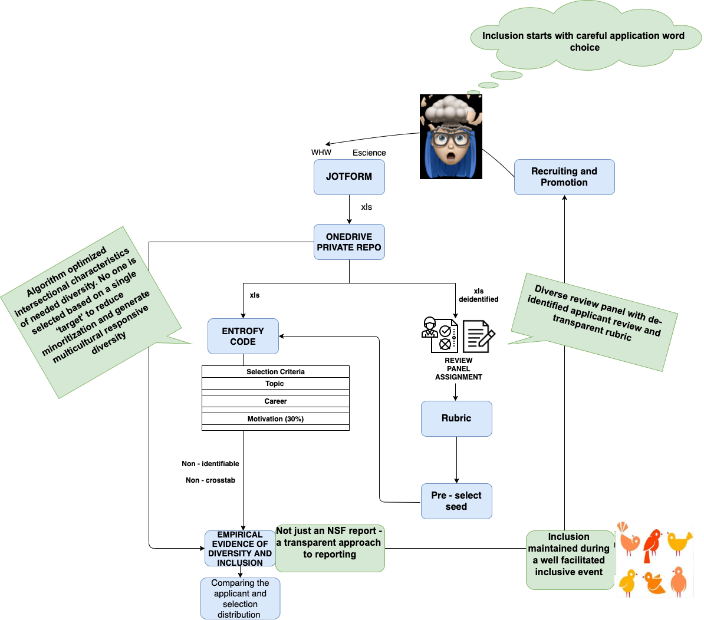

# Diversify

Participant selection for workshops and conferences made easy.

Selection of participants for meetings as a discrete optimization problem.

## Entrofy Overview

Given a list of participants with various "attributes" (e.g., gender, career stage, subfield, geography, years since PhD), the code finds the distribution of values within each attribute (e.g, male, female) and generate a subset that approximates target value distributions (e.g, 50% male/female, 30% junior, 30% non-US). The attributes and values are user determined and based on the data present in uploaded CSV file.

**Important**: While a flask app exists in this repo, it is only a very rudimentary reference implementation of what we'd like an actual app to look like and _not fully functional_. Please use the Python code instead, as demonstrated in the tutorial Jupyter notebook, or contact us for advice.




## About

This tool was born out of a very practical need: given that there are more applicants for a workshop than spaces, and given that  some constraints on a target mixture of participants, and perhaps some pre-selected participants (e.g. invited speakers), how can the set of participants be identified such that it meets the target mixture as much as possible?

Instead of letting human organisers decide heuristically (including all the various biases that this entails [refs?]), this tool treats it as a (fairly complex) optimization problem, where the computer finds a subset of applicants that most closely matches the target mixture.

The targets could be based on various objectives that depend on the workshop or conference: for example, one could optimize for a certain mixture of abstract scores, for a breadth of talk topics, for a certain ratio of (academic) seniority, or for measures like gender or ethnicity.

Note that this is explicitly not the same as a quota: the underlying algorithim optimizes for the subset of participants that overall matches up with the targets, taking into account all targets simultaneously. It is also possible to include relative weights between targets, depending on how important they are to you.

### Input 
- CSV file with candidates, attribute, and values.
- Target size of subset
- Target distribution of each value
- Weights assigned to each value 

### Output 
- Distribution of each value in input file
- Subset of candidates which approximate the target distributions
- Distribution of each value in subset

## Install Instructions

# Installation updates Cband & Jphuong 01/10/2019
1. Be sure conda environment has python2
> python --version
2. Activate environment
> source activate py2 
or
> conda create py2 -n python=2.7
then 
> source activate py2 
3. From entrofy/apps directory
Edited to remove json, and configparser edited to lowercase.
> pip install -r requirements.txt
4. From entrofy folder
python setup.py install
5. In the command line used for source activate, spin up Jupyter Notebook
> jupyter notebook  
in other terminals, the default environment will spin up
6. Open Jupyter Notebook, go to kernal drop down box, select python2 kernal. 

**Note**: The app is under active development and requires updates before running reliably. As of now, it's not really usable. Use the Python library instead (see below).

Download the app/ directory

```
pip install -r requirements.txt
python server.py
```
then go to http://localhost:5000/ in your web browser

## Usage Instructions

Below are some practical considerations.
You can find a Jupyter notebook in this repository that will show how to run the code itself in more detail. For a recent example of how Entrofy was used in practice, see [the PyAstro 2017 participant selection repo](https://github.com/dhuppenkothen/PyAstro17ParticipantSelection). 

First, collect data about the acceptable participants. This requires you to know which criteria you actually care about when selecting participants. This will very strongly depend on the scope, the objective and format of your workshop or conference. 

### Input CSV file format

- header row required. no spaces in header names.
- first column required to be a unique identifier. Either a unique numerical key (anonymous) or full name.
- each column is intrepreted as an attribute (e.g, gender) 
- each field in a column is intrepreted as a value of the attribute
- missing data should be left as empty strings

### Interface 

- to ignore a parameter, set the weight to 0
- pre-selected candidates may be selected (left-click) to ensure their inclusion in the subset

## Implementation Suggestions

- input list should be all acceptable candidates
- input list should include pre-selected candidates so they are included in the distributions

## Google Colab Instructions

- Go to One Drive and Download data from Jotform as csv.
- Open Google colab : https://colab.research.google.com/notebook
- Upload the required notebook
- Add the following code before any of the exisiting code and run in separate cells:

```python
from google.colab import drive

drive.mount('/content/drive')
```

```python
CODE_PATH = '/content/drive/Shared drives/Freshwater/2020/Diversify/'
import os
os.chdir(CODE_PATH)
```
- In the side bar, Upload the form responses csv file
- Continue execution of the rest of the notebook

## Things you should know

- output list is not necessarily reproducible -- each run will create a new list
- numbers are assumed to be from a continous distribution (e.g., years since PhD)
- quantitative attributes are divided up into at most 5 bins
